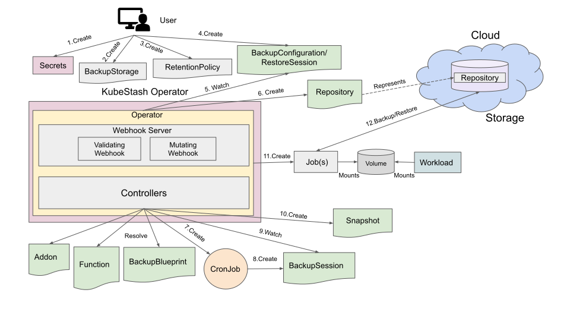

# KubeStash Architecture

KubeStash is a Kubernetes operator for [restic](https://restic.net/). At the heart of KubeStash, it is a Kubernetes [controller](https://book.kubebuilder.io/cronjob-tutorial/controller-overview.html). It uses [Custom Resource Definition(CRD)](https://kubernetes.io/docs/concepts/extend-kubernetes/api-extension/custom-resources/) to specify targets and behaviors of backup and restore process in a Kubernetes native way. A simplified architecture of KubeStash is shown below:

<figure align="center">
  
  <figcaption align="center">Fig: KubeStash Architecture</figcaption>
</figure>

## Components

KubeStash consists of various components that implement backup and restore logic. This section will give you a brief overview of such components.

### KubeStash Operator

When a user installs KubeStash, it creates a Kubernetes [Deployment](https://kubernetes.io/docs/concepts/workloads/controllers/deployment/) typically named `kubestash-operator`. This deployment controls the entire backup and restore process. `kubestash-operator` deployment runs two containers. One of them is called `operator` which performs the core functionality of KubeStash and the other one is a side-car proxy whose purpose is to protect the manager from malicious attacks (see [kube-rbac-proxy](https://github.com/brancz/kube-rbac-proxy/blob/master/README.md), to learn more about its motivations).

#### Operator

`operator` container runs all the controllers as well as webhook server.

##### Controllers

Controllers watch various Kubernetes resources as well as the custom resources introduced by KubeStash. It applies the backup or restore logic for a target resource when requested by users.

### Backend

Backend is the storage where KubeStash stores backed up files. It can be a cloud storage like GCS bucket, AWS S3, Azure Blob Storage etc. or a Kubernetes persistent volume like [NFS](https://kubernetes.io/docs/concepts/storage/volumes/#nfs), [PersistentVolumeClaim](https://kubernetes.io/docs/concepts/storage/volumes/#persistentvolumeclaim), etc. To learn more about backend, please visit [here](/docs/guides/backends/overview/index.md).

### CronJob

When a user creates a [BackupConfiguration](/docs/concepts/crds/backupconfiguration/index.md) object, KubeStash creates a CronJob with the schedule specified in it. At each scheduled slot, this CronJob triggers a backup for the targeted workload.

### Backup Job

When a user creates a [BackupConfiguration](/docs/concepts/crds/backupconfiguration/index.md) object, KubeStash creates a job or multiple jobs (depending on target) to take backup at each trigger.

### Restore Job

When a user creates a [RestoreSession](/docs/concepts/crds/restoresession/index.md) object, KubeStash creates a job or multiple jobs (depending on target) to restore the target.

### Custom Resources

KubeStash uses [Custom Resource Definition(CRD)](https://kubernetes.io/docs/concepts/extend-kubernetes/api-extension/custom-resources/) to specify targets and behaviors of backup and restore process in a Kubernetes native way. This section will give you a brief overview of the custom resources used by KubeStash.

- **BackupStorage:** A `BackupStorage` specifies the backend information where the backed up data of different applications will be stored. A user can consider `BackupStorage` as a representation of a bucket in Kubernetes native way. A user has to create `BackupStorage` object. For more details about `BackupStorage`, please visit [here](/docs/concepts/crds/backupstorage/index.md).

- **Repository:** A `Repository` specifies the information about the targeted application that has been backed up and the `BackupStorage` where the backed up data is being stored. It also holds a list of recent Snapshots that have been taken in this Repository. KubeStash will create a `Repository` for a target. For more details about `Repository`, please visit [here](/docs/concepts/crds/repository/index.md).

- **BackupConfiguration:** A `BackupConfiguration` specifies the configuration for taking backup of a target application. A user has to create one `BackupConfiguration` object for each backup target. When a user creates a `BackupConfiguration`, KubeStash creates a `Repository` and a CronJob for it. For more details about `BackupConfiguration`, please visit [here](/docs/concepts/crds/backupconfiguration/index.md).

- **BackupSession:** A `BackupSession` object represents a backup run of a target. It is created by respective CronJob at each scheduled time slot. It refers to a `BackupConfiguration` object for necessary configuration. A user can also create a `BackupSession` object manually to trigger instant backups. For more details about `BackupSession`s, please visit [here](/docs/concepts/crds/backupsession/index.md).

- **RestoreSession:** A `RestoreSession` represents one restore run for the targeted application. A user has to create a `RestoreSession` object when s/he wants to restore a target. When s/he creates a `RestoreSession`, KubeStash creates job or multiple jobs to restore. For more details about `RestoreSession`, please visit [here](/docs/concepts/crds/restoresession/index.md).

- **HookTemplate:** A `HookTemplate` defines a template for some action that will be executed before or/and after backup/restore process. For example, there could be a `HookTemplate` that pause an application before backup and another `HookTemplate` that resume the application after backup. A user has to create `HookTemplate`. For more details about `HookTemplate`, please visit [here](/docs/concepts/crds/hooktemplate/index.md).

- **Addon:** An `Addon` specifies the backup and restore capabilities for a particular resource. For example, `MySQL` addon specifies the backup and restore capabilities of `MySQL` database where `Postgres` addon specifies backup and restore capabilities for `PostgreSQL` database. An `Addon` CR defines the backup and restore tasks that can be performed by this addon. For more details about `Addon`, please visit [here](/docs/concepts/crds/addon/index.md).

- **Function:** A `Function` is a template for a container that performs a specific action, i.e. backup, restore etc. For more details about `Function`, please visit [here](/docs/concepts/crds/function/index.md).

- **BackupBlueprint:** A `BackupBlueprint` enables user to define a common template for taking backup for all the similar applications. Then, user can just apply some annotations in the targeted application to enable backup. KubeStash will automatically resolve the template and create a `BackupConfiguration` for the targeted application. For more details about `BackupBlueprint`, please visit [here](/docs/concepts/crds/backupblueprint/index.md).

- **Snapshot:** A `Snapshot` represents the state of a backup run to a particular `Repository`. Multiple components of the same target may be backed up in the same `Snapshot`. KubeStash operator is responsible for creating `Snapshot` CR. `Snapshot` is not supposed to be created/edited by the end user. For more details about `Snapshot`, please visit [here](/docs/concepts/crds/snapshot/index.md).

- **RetentionPolicy:** A `RetentionPolicy` specifies how the old Snapshots should be cleaned up. A user has to create `RetentionPolicy`. For more details about `RetentionPolicy`, please visit [here](/docs/concepts/crds/retentionpolicy/index.md).