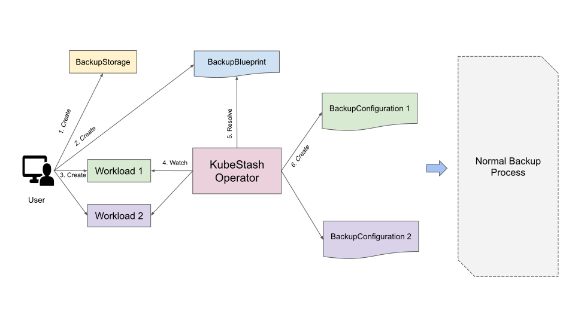

# Auto Backup with KubeStash

KubeStash can be configured to automatically backup of any stateful workloads in your cluster. KubeStash enables cluster administrators to deploy backup blueprints ahead of time so that application owners can easily backup any types of workload with a few annotations. This allows enterprises to stay prepared for disaster scenarios and recover from offsite secure backups in case of a disaster on public cloud and on-premises datacenters.

## What is Auto Backup

KubeStash uses 1-1 mapping between `BackupConfiguration` and the target. So, whenever you want to backup a target(workload/PVC/database), you have to create a `BackupConfiguration` object. This could become tiresome when you are trying to backup similar types of target and `BackupConfiguration` has only a slight difference. To mitigate this problem, KubeStash provides a way to specify a blueprint for this object via `BackupBlueprint` CR. In KubeStash parlance, we call this process as **Auto Backup**.

You have to create only one `BackupBlueprint` for all similar types of target. For example, you need only one `BackupBlueprint` for Deployment, DaemonSet, StatefulSet etc. Similarly, you have to create only one `BackupBlueprint` for all PostgreSQL databases. Then, you just need to add some annotations in the target. KubeStash will automatically create respective `BackupConfiguration` object using the blueprint and perform backups on provided schedule.

## How Auto Backup Works?

The following diagram shows how automatic backup works in KubeStash. Open the image in a new tab to see the enlarged version.

<figure align="center">
  
  <figcaption align="center">Fig: Auto Backup Overview</figcaption>
</figure>

The automatic backup process consists of the following steps:

1. A user creates a `BackupStorage` and corresponding storage `Secret` with necessary credentials of the backend where the backed up data will be stored.
2. Then, he creates a `BackupBlueprint` custom resource that specifies a blueprint for `BackupConfiguration` object.
3. Then, he creates a workload with some annotations for automatic backup.
4. KubeStash operator watches for workloads. When it finds a workload with annotations for automatic backup, it finds out the respective `BackupBlueprint`.
5. Then, KubeStash operator resolves the blueprint by replacing variable fields of the blueprint with respective information from the workload.
6. Then, it creates a `BackupConfiguration` object for the workload according to the resolved blueprint.
7. Finally, KubeStash starts rest of the standard backup process as discussed in [here](/docs/guides/workloads/overview/index.md).

## Next Step

- Learn how to configure automatic backup for workloads from [here](/docs/guides/auto-backup/workload/index.md).
- Learn how to configure automatic backup for PVCs from [here](/docs/guides/auto-backup/pvc/index.md).
