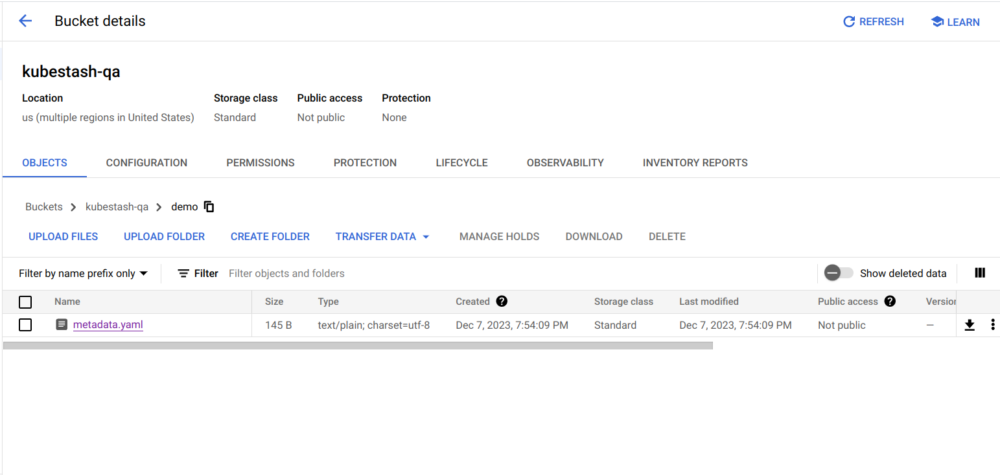

> New to KubeStash? Please start [here](/docs/concepts/README.md).

# KubeStash Backends

## BackupStorage

KubeStash supports various backends for use as a BackupStorage. It can be a cloud storage like GCS bucket, AWS S3, Azure Blob Storage etc. or a Kubernetes persistent volume like [HostPath](https://kubernetes.io/docs/concepts/storage/volumes/#hostpath), [PersistentVolumeClaim](https://kubernetes.io/docs/concepts/storage/volumes/#persistentvolumeclaim), [NFS](https://kubernetes.io/docs/concepts/storage/volumes/#nfs) etc.

The following diagram shows how kubestash backup container accesses and backs up data into a backend.

<figure align="center">
	
  <figcaption align="center">Fig: KubeStash Backend Overview</figcaption>
</figure>

You need to create a [BackupStorage]() object that contains backend information along with a Secret object containing the corresponding backend credentials required for accessing the backend.

When you create the BackupStorage object, the Kubestash operator reads backend information from this object and retrieves access credentials from the associated Secret and initializes the BackupStorage.

Below, a screenshot that shows initialization of a BackupStorage in a GCS bucket named `kubestash-qa`:

<figure align="center">
  
  <figcaption align="center">Fig: BackupStorage initialization in GCS Backend</figcaption>
</figure>

Here, `kubestash-qa` serves as the bucket name, and the presence of `metadata.yaml` indicates the successful initialization of the BackupStorage.

## Repository
Once the BackupStoarge is initialize and in ready phase then the next steps is creating [BackupConfiguration](). When you create a BackupConfiguration, then KubeStash operator retrieves [Repository]() information from it and create Repository. This Repository object serve as a container for effectively managing and storing the backups data.

Below, a screenshot the shows a `Repository` with backup data under a `BackupStorage` named `demo`:

## Next Steps
- Learn how to configure `Kubernetes Volume` as backend from [here]().
