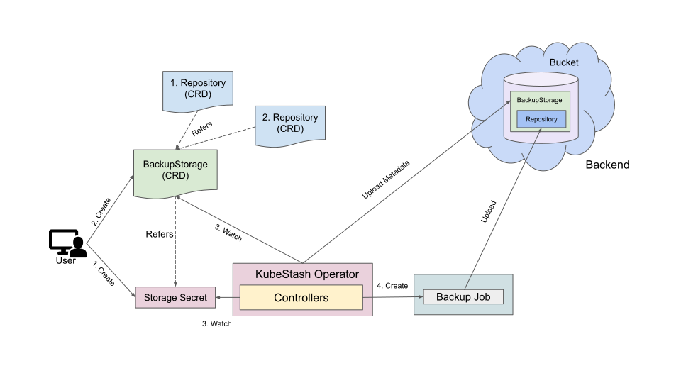

> New to KubeStash? Please start [here](/docs/concepts/README.md).

# KubeStash Backends

## BackupStorage

KubeStash supports various backends for storing backup data. It can be a cloud storage like GCS bucket, AWS S3, Azure Blob Storage etc. or a Kubernetes persistent volume like [HostPath](https://kubernetes.io/docs/concepts/storage/volumes/#hostpath), [PersistentVolumeClaim](https://kubernetes.io/docs/concepts/storage/volumes/#persistentvolumeclaim), [NFS](https://kubernetes.io/docs/concepts/storage/volumes/#nfs) etc.

The following diagram shows how KubeStash operator and backup container accesses and backs up data into a backend.

<figure align="center">
	
  <figcaption align="center">Fig: KubeStash Backend Overview</figcaption>
</figure>

The Backend process works in the following steps:

- At first user creates a [BackupStorage](/docs/concepts/crds/backupstorage/index.md) object that contains the backend information along with a `Secret` object containing the corresponding backend credentials required for accessing the backend.
- KubeStash operator watches for `BackupStorage` custom resources and `Secrets`. When it finds a `BackupStorage` object, it initializes the storage by uploading the `metadata.yaml` file.

Below, a screenshot that shows initialization of a `BackupStorage` in a GCS bucket named `kubestash-qa`:

<figure align="center">
  
  <figcaption align="center">Fig: BackupStorage initialization in GCS Backend</figcaption>
</figure>

Here, `kubestash-qa` serves as the bucket name, and the presence of `metadata.yaml` indicates the successful initialization of the BackupStorage.

## Next Steps
- Learn how to configure `Kubernetes Volume` as backend from [here](/docs/guides/backends/local/index.md).
- Learn how to configure `AWS S3/Minio/Rook` backend from [here](/docs/guides/backends/s3/index.md).
- Learn how to configure `Google Cloud Storage (GCS)` backend from [here](/docs/guides/backends/gcs/index.md).
- Learn how to configure `Microsoft Azure Storage` backend from [here](/docs/guides/backends/azure/index.md).
