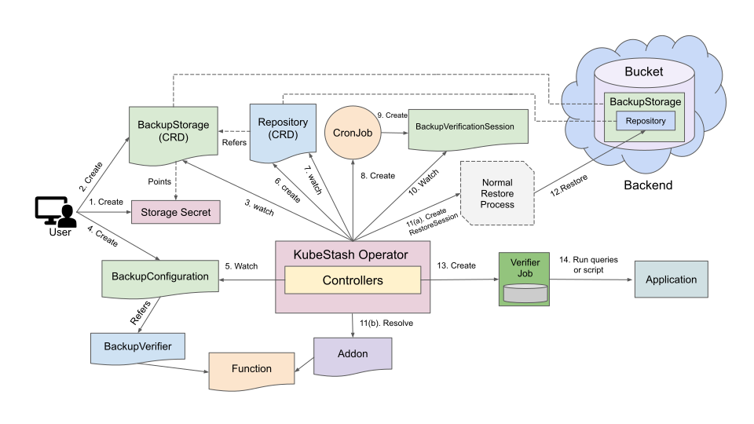

> New to KubeStash? Please start [here](/docs/concepts/README.md).

# KubeStash Backup Verification

KubeStash supports verifying backups using different types of verification strategies.

## Before You Begin

- You should be familiar with the following `KubeStash` concepts:
  - [BackupConfiguration](/docs/concepts/crds/backupconfiguration/index.md)
  - [BackupVerifier](/docs/concepts/crds/backupverifier/index.md)
  - [BackupVerificationSession](/docs/concepts/crds/backupverificationsession/index.md)
  - [RestoreSession](/docs/concepts/crds/restoresession/index.md)
  - [Repository](/docs/concepts/crds/repository/index.md)

## How Backup Verification Process Works

The following diagram shows how KubeStash verifies backups. Open the image in a new tab to see the enlarged version.

<figure align="center">
   
    <figcaption align="center">Fig: Backup Verification process in KubeStash</figcaption>
</figure>

The backup process consists of the following steps:

1. At first, a user creates a `Secret`. This secret holds the credentials to access the backend where the backed up data will be stored.

2. Then, she creates a `BackupStorage` custom resource that specifies the backend information, along with the `Secret` containing the credentials needed to access the backend.

3. KubeStash operator watches for `BackupStorage` custom resources. When it finds a `BackupStorage` object, it initializes the `BackupStorage` by uploading the `metadata.yaml` file into the target storage.

4. Then, she creates a `BackupConfiguration` custom resource that specifies the targeted workload, the Addon info with a specified task, etc. It also provides information about one or more repositories, each indicating a path and a `BackupStorage` for storing the backed-up data.

5. KubeStash operator watches for `BackupConfiguration` objects.

6. Once the KubeStash operator finds a `BackupConfiguration` object, it creates `Repository` with the information specified in the `BackupConfiguration`.

7. KubeStash operator watches for `Repository` custom resources. When it finds the `Repository` object, it Initializes `Repository` by uploading `repository.yaml` file into the `spec.sessions[*].repositories[*].directory` path specified in `BackupConfiguration`.

8. Then, it creates a `CronJob` for each session with the schedule specified in `BackupConfiguration` to trigger backup periodically.

9. On the next scheduled slot, the `CronJob` triggers a backup by creating a `BackupSession` custom resource.

10. KubeStash operator watches for `BackupSession` custom resources.

11. When it finds a `BackupSession` object, it creates a `Snapshot` custom resource for each `Repository` specified in the `BackupConfiguration`.

12. Then it resolves the respective `Addon` and `Function` and prepares backup `Job`(s) definition.

13. Then, it mounts the targeted workload volume(s) into the `Job`(s) and creates it/them.

14. The `Job`(s) takes backup of the targeted workload.

15. After the backup process is completed, the backup `Job`(s) updates the `status.components[*]` field of the `Snapshot` resources with backup information of the target application components.
