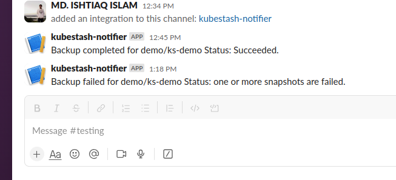

# Sending Backup Notification to Slack Channel

In this guide, we are going to show you how to send backup notifications to a Slack channel. Here, we are going to use [Slack Incoming Webhook](https://api.slack.com/messaging/webhooks) to send the notification.

## Before You Begin

- At first, you need to have a Kubernetes cluster, and the `kubectl` command-line tool must be configured to communicate with your cluster. If you do not already have a cluster, you can create one by using [kind](https://kind.sigs.k8s.io/docs/user/quick-start/).
- Install KubeStash in your cluster following the steps [here](/docs/setup/install/stash/index.md).
- If you haven't read about how hooks work in KubeStash, please check it from [here](/docs/guides/hooks/overview/index.md).

You should be familiar with the following `KubeStash` concepts:

- [BackupConfiguration](/docs/concepts/crds/backupconfiguration/index.md)
- [BackupSession](/docs/concepts/crds/backupsession/index.md)
- [BackupStorage](/docs/concepts/crds/backupstorage/index.md)
- [Function](/docs/concepts/crds/function/index.md)
- [HookTemplate](/docs/concepts/crds/hooktemplate/index.md)

To keep everything isolated, we are going to use a separate namespace called `demo` throughout this tutorial.

```bash
$ kubectl create ns demo
namespace/demo created
```

## Configure Slack Incoming Webhook

At first, let's configure a Slack incoming webhook. We are going to send the notifications to a channel named `testing`. Now, follow the steps below:

- Go to https://api.slack.com/messaging/webhooks and click the `Create your Slack app` button as shown in the following image.

<figure align="center">
  
</figure>

- We are going to build a new app. So, select the `From scratch` option as below.

<figure align="center">
  
</figure>

- Now, give your app a name and select your workspace.

<figure align="center">
  
</figure>

- Then, select your application type as `Incoming Webhooks`.

<figure align="center">
  
</figure>

- Now, activate your incoming webhook.

<figure align="center">
  
</figure>

- Scroll down and click on the `Add New Webhook to Workspace` button.

<figure align="center">
  
</figure>

- Now, select your desired Slack channel where you want to send the notifications. Then, click on the  `Allow` button.

<figure align="center">
  
</figure>

- Finally, copy the webhook path starting from `/service/****`. We will use this path in our hook specification.

<figure align="center">
  
</figure>

Our Slack incoming webhook is ready to receive notifications. In the next section, we are going to configure a Stash webhook to send backup notifications to this incoming webhook.

## Prepare Application

Now, let's deploy a sample application and generate some sample data for it. Here, is the YAML of a DaemonSet that we are going to deploy:

```yaml
apiVersion: apps/v1
kind: DaemonSet
metadata:
  labels:
    app: ks-demo
  name: ks-demo
  namespace: demo
spec:
  selector:
    matchLabels:
      app: ks-demo
  template:
    metadata:
      labels:
        app: ks-demo
      name: busybox
    spec:
      containers:
        - args: ["echo sample_data > /source/data/data.txt && sleep 3000"]
          command: ["/bin/sh", "-c"]
          image: busybox
          imagePullPolicy: IfNotPresent
          name: busybox
          volumeMounts:
            - mountPath: /source/data
              name: source-data
      restartPolicy: Always
      volumes:
        - name: source-data
          hostPath:
            path: /kubestash/source/data
```

Let's deploy the above DaemonSet.

```bash
$ kubectl apply -f https://github.com/kubestash/docs/raw//docs/guides/hooks/slack-notification/examples/daemonset.yaml
daemonset.apps/ks-demo created
```

Let's verify that the sample data has been created successfully:

```bash
$ kubectl exec -n demo ks-demo-b4mxd -- ls /source/data
data.txt
```

Our application is ready with some sample data. In the next section, we are going to setup a backup for this application.

## Prepare Backend

We are going to store our backed up data into a GCS bucket. We have to create a Secret with necessary credentials and a BackupStorage crd to use this backend. If you want to use a different backend, please read the respective backend configuration doc from [here](/docs/guides/backends/overview/index.md).

**Create Secret:**

Let's create a secret called `gcs-secret` with access credentials to our desired GCS bucket,

```bash
$ echo -n '<your-project-id>' > GOOGLE_PROJECT_ID
$ cat /path/to/downloaded-sa-key.json > GOOGLE_SERVICE_ACCOUNT_JSON_KEY
$ kubectl create secret generic -n demo gcs-secret \
    --from-file=./GOOGLE_PROJECT_ID \
    --from-file=./GOOGLE_SERVICE_ACCOUNT_JSON_KEY
secret/gcs-secret created
```

**Create BackupStorage:**

Now, create a `BackupStorage` using this secret. Below is the YAML of `BackupStorage` crd we are going to create,

```yaml
apiVersion: storage.kubestash.com/v1alpha1
kind: BackupStorage
metadata:
  name: gcs-storage
  namespace: demo
spec:
  storage:
    provider: gcs
    gcs:
      bucket: kubestash-qa
      prefix: demo
      secretName: gcs-secret
  usagePolicy:
    allowedNamespaces:
      from: All
  default: true
  deletionPolicy: WipeOut
```

Let's create the BackupStorage we have shown above,

```bash
$ kubectl apply -f https://github.com/kubestash/docs/raw//docs/guides/hooks/slack-notification/examples/backupstorage.yaml
backupstorage.storage.kubestash.com/gcs-storage created
```

Now, we are ready to backup our sample data into this backend.

**Create RetentionPolicy:**

Now, let's create a `RetentionPolicy` to specify how the old Snapshots should be cleaned up.

Below is the YAML of the `RetentionPolicy` object that we are going to create,

```yaml
apiVersion: storage.kubestash.com/v1alpha1
kind: RetentionPolicy
metadata:
  name: demo-retention
  namespace: demo
spec:
  default: true
  failedSnapshots:
    last: 2
  maxRetentionPeriod: 2mo
  successfulSnapshots:
    last: 5
  usagePolicy:
    allowedNamespaces:
      from: All
```
Notice the `spec.usagePolicy` that allows referencing the `RetentionPolicy` from all namespaces. To allow specific namespaces, we can configure it accordingly by following [RetentionPolicy usage policy](/docs/concepts/crds/retentionpolicy/index.md#retentionpolicy-spec).

Let’s create the above `RetentionPolicy`,

```bash
$ kubectl apply -f https://github.com/kubestash/docs/raw//docs/guides/hooks/slack-notification/examples/retentionpolicy.yaml
retentionpolicy.storage.kubestash.com/demo-retention created
```

## Backup

In this section, we are going to setup a backup for the application we deployed earlier. We are going to configure a `postBackup` hook to send a notification to our Slack incoming webhook when a backup session completes.

**Create HookTemplate**

Below is the YAML of the `HookTemplate` CR to notify all backup notification in slack ,

```yaml
apiVersion: core.kubestash.com/v1alpha1
kind: HookTemplate
metadata:
  name: slack-hook
  namespace: demo
spec:
  usagePolicy:
    allowedNamespaces:
      from: All
  action:
    httpPost:
      host: hooks.slack.com
      path: /services/XX/XX/XX # provide webhook URL starting from "/services/****"
      port: 443
      scheme: HTTPS
      httpHeaders:
        - name: Content-Type
          value: application/json
      body: |
        {{$msg := dict "type" "mrkdwn" "text" "ooo"}}{{if eq .Status.Phase "Succeeded"}}{{- $msg = dict  "type" "mrkdwn" "text" (printf "Backup completed for %s/%s Status: %s." .Namespace .Target.Name .Status.Phase) -}}{{else}}{{- $msg = dict  "type" "mrkdwn" "text" (printf "Backup failed for %s/%s Status: %s." .Namespace .Target.Name .Status.Error) -}}{{end}}
          {
            "blocks": [
                {
                  "type": "section",
                  "text": {{ toJson $msg }}
                }
              ]
          }
  executor:
    type: Operator
```

Here we have setup an action to send an HTTP POST request. In the `path` field of the `httpPost` section, we have specified the Slack incoming webhook path that we copied in the last step of configuring Slack incoming webhook.

Let’s create the above `HookTemplate`,

```bash
$ kubectl apply -f https://github.com/kubestash/docs/raw//docs/guides/hooks/slack-notification/examples/hooktemplate.yaml
hooktemplate.core.kubestash.com/slack-hook created
```

Now, we need to create a secret with a Restic password for backup data encryption.

**Create Secret:**

Let's create a secret called `encrypt-secret` with the Restic password,

```bash
$ echo -n 'changeit' > RESTIC_PASSWORD
$ kubectl create secret generic -n demo encrypt-secret \
    --from-file=./RESTIC_PASSWORD \
secret "encrypt-secret" created
```

Here, is the YAML of the BackupConfiguration that we are going to create:

```yaml
apiVersion: core.kubestash.com/v1alpha1
kind: BackupConfiguration
metadata:
  name: sample-backup
  namespace: demo
spec:
  target:
    apiGroup: apps
    kind: DaemonSet
    name: ks-demo
    namespace: demo
  backends:
    - name: gcs-backend
      storageRef:
        namespace: demo
        name: gcs-storage
      retentionPolicy:
        name: demo-retention
        namespace: demo
  sessions:
    - name: frequent-backup
      sessionHistoryLimit: 3
      scheduler:
        schedule: "*/5 * * * *"
        jobTemplate:
          backoffLimit: 1
      hooks:
        postBackup:
          - name: slack-notification
            hookTemplate:
              name: slack-hook
              namespace: demo
            maxRetry: 3
            timeout: 30s
      repositories:
        - name: daemon-repo
          backend: gcs-backend
          directory: /demo/daemon
          encryptionSecret:
            name: encrypt-secret
            namespace: demo
      addon:
        name: workload-addon
        tasks:
          - name: logical-backup
            params:
              paths: /source/data
      retryConfig:
        maxRetry: 2
        delay: 1m
```

Notice the `hooks` section. We have specified the HookTemplate as the `postBackup` hook for this BackupConfiguration.

Also, notice the `body` field of the `httpPost` section. We have used Go template to include information about the backup target and status.

Let's create the BackupConfiguration we have shown above,

```bash
$ kubectl apply -f https://github.com/kubestash/docs/raw//docs/guides/hooks/slack-notification/examples/all_backup_notification.yaml
backupconfiguration.core.kubestash.com/sample-backup created
```

**Wait for BackupSession:**

Now, let's wait for a BackupSession. Run the following command to watch for BackupSession.

```bash
$ kubectl get backupsession --all-namespaces -w
NAMESPACE   NAME                                       INVOKER-TYPE          INVOKER-NAME    PHASE       DURATION   AGE
demo        sample-backup-frequent-backup-1708411503   BackupConfiguration   sample-backup   Succeeded              10m
```

We can see from the above output that the backup session has succeeded.

**Verify Notification:**

Now, if we go to the Slack channel we have configured for notification. We should see a notification similar to this:

<figure align="center">
  
</figure>

### Sending Only Backup Failure Notification

**Create HookTemplate**

Below is the YAML of the `HookTemplate` CR to notify only failed backup notification in slack ,

```yaml
apiVersion: core.kubestash.com/v1alpha1
kind: HookTemplate
metadata:
  name: slack-hook
  namespace: demo
spec:
  usagePolicy:
    allowedNamespaces:
      from: All
  action:
    httpPost:
      host: hooks.slack.com
      path: /services/XX/XX/XX # provide webhook URL starting from "/services/****"
      port: 443
      scheme: HTTPS
      httpHeaders:
        - name: Content-Type
          value: application/json
      body: |
        {{- $msg := dict  "type" "mrkdwn" "text" (printf "Backup failed for %s/%s Status: %s." .Namespace .Target.Name .Status.Error) -}}
          {
            "blocks": [
                {
                  "type": "section",
                  "text": {{ toJson $msg }}
                }
              ]
          }
  executor:
    type: Operator
```

Let’s create the above `HookTemplate`,

```bash
$ kubectl apply -f https://github.com/kubestash/docs/raw//docs/guides/hooks/slack-notification/examples/hooktemplate_failed.yaml
hooktemplate.core.kubestash.com/slack-hook configured
```

We can also use the `executionPolicy` to send notification only for the failed backups. Check the following BackupConfiguration:

```yaml
apiVersion: core.kubestash.com/v1alpha1
kind: BackupConfiguration
metadata:
  name: sample-backup
  namespace: demo
spec:
  target:
    apiGroup: apps
    kind: DaemonSet
    name: ks-demo
    namespace: demo
  backends:
    - name: gcs-backend
      storageRef:
        namespace: demo
        name: gcs-storage
      retentionPolicy:
        name: demo-retention
        namespace: demo
  sessions:
    - name: frequent-backup
      sessionHistoryLimit: 3
      scheduler:
        schedule: "*/5 * * * *"
        jobTemplate:
          backoffLimit: 1
      hooks:
        postBackup:
          - name: slack-notification
            hookTemplate:
              name: slack-hook
              namespace: demo
            maxRetry: 3
            timeout: 30s
            executionPolicy: OnFailure
      repositories:
        - name: daemon-repo
          backend: gcs-backend
          directory: /demo/daemon
          encryptionSecret:
            name: encrypt-secret
            namespace: demo
      addon:
        name: workload-addon
        tasks:
          - name: logical-backup
            params:
              paths: /wrong/data
      retryConfig:
        maxRetry: 2
        delay: 1m
```

Here, we have provided an invalid path in the `paths` field of the `target` section. This will force the backup to fail.

Notice that, this time we have specified the `executionPolicy` field to `OnFailure`. This will tell KubeStash to send the notification only if the backup fails. In the message body, we have included information about target and reason of the failure.

Let's apply the above BackupConfiguration:

```bash
$ kubectl apply -f https://github.com/kubestash/docs/raw//docs/guides/hooks/slack-notification/examples/failed_backup_notification.yaml
backupconfiguration.core.kubestash.com/sample-backup configured
```

**Wait for BackupSession:**

Again, let's wait for a scheduled backup. Run the following command to watch for a BackupSession:

```bash
$ kubectl get backupsession --all-namespaces -w
NAMESPACE   NAME                                       INVOKER-TYPE          INVOKER-NAME    PHASE   DURATION   AGE
demo        sample-backup-frequent-backup-1708413480   BackupConfiguration   sample-backup   Failed             8s
```

As we can see that the backup has failed this time. Let's verify the failure notification.

**Verify Notification:**

If we go to the Slack channel, we should see a new notification has been sent. This time it indicates a failure and also contains the failure reason.

<figure align="center">
  
</figure>

## Cleanup

To clean up the test resources we have created throughout this tutorial, run the following commands:

```bash
kubectl delete backupconfiguration -n demo sample-backup
kubectl delete backupstorage -n demo gcs-storage
kubectl delete secret -n demo gcs-secret
kubectl delete secret -n demo encrypt-secret
kubectl delete daemonset -n demo ks-demo
kubectl delete hooktemplate -n demo slack-hook
```
