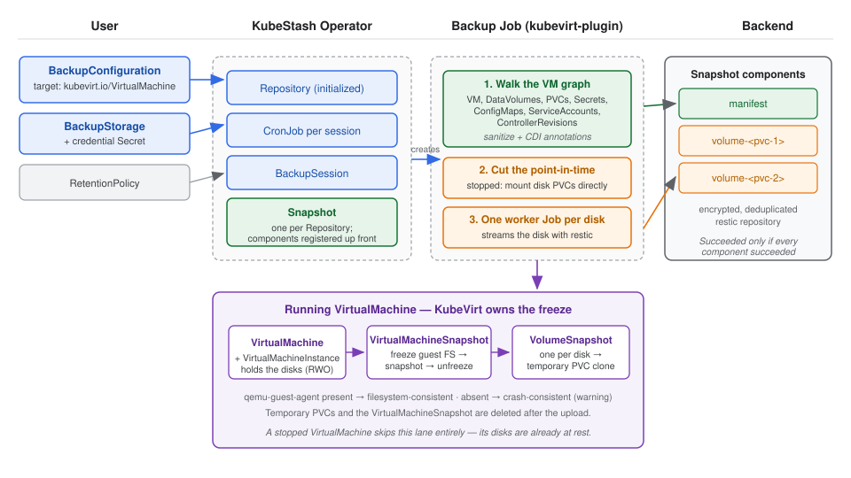
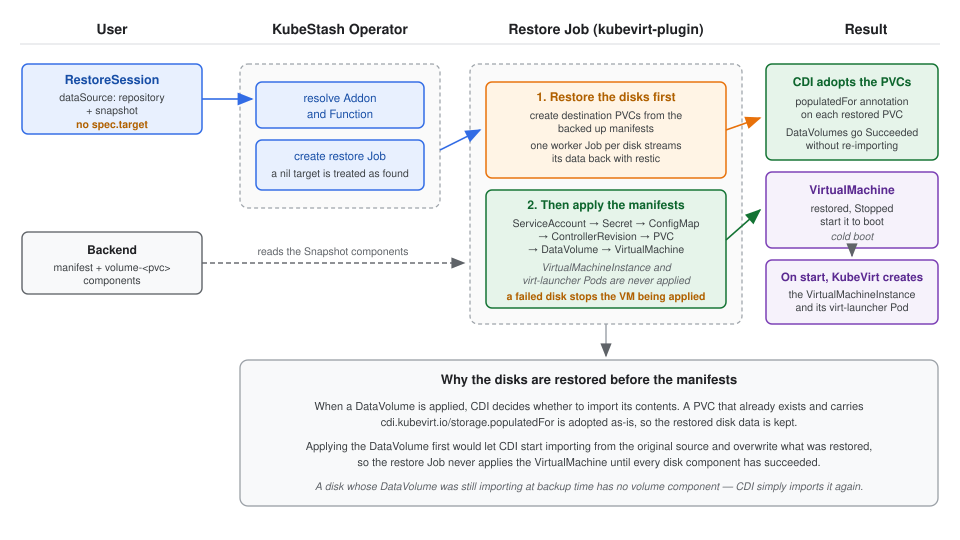

# Backup and Restore KubeVirt VirtualMachines using KubeStash

This guide will show you how KubeStash backs up and restores a KubeVirt `VirtualMachine`, including both its definition and the data on its disks.

## Before You Begin

- You should be familiar with the following `KubeStash` concepts:
  - [BackupConfiguration](/docs/concepts/crds/backupconfiguration/index.md)
  - [BackupSession](/docs/concepts/crds/backupsession/index.md)
  - [RestoreSession](/docs/concepts/crds/restoresession/index.md)
  - [BackupStorage](/docs/concepts/crds/backupstorage/index.md)
  - [Snapshot](/docs/concepts/crds/snapshot/index.md)

## What Gets Backed Up

A `VirtualMachine` is not a single object. Running one depends on a graph of other objects, and restoring it requires all of them. KubeStash walks that graph and captures:

- The `VirtualMachine` itself
- The `DataVolume`s and `PersistentVolumeClaim`s its disks are backed by
- `Secret`s, `ConfigMap`s and `ServiceAccount`s referenced as volumes, including cloud-init `userDataSecretRef` / `networkDataSecretRef` and access-credential secrets
- The `ControllerRevision`s that pin an instancetype or preference
- Backend-state PVCs for a persistent TPM or EFI, and memory-dump PVCs

Alongside those manifests, the data on every disk PVC is copied to the backend. Runtime objects are deliberately **not** captured: the `VirtualMachineInstance` and its `virt-launcher` Pod are recreated by KubeVirt, so a restored VM cold-boots.

This produces a single `Snapshot` per `Repository` whose `status.components` holds one entry per unit of work:

| Component | Content |
|---|---|
| `manifest` | The sanitized manifests of the whole dependency graph |
| `volume-<pvc-name>` (one per disk) | The disk data — a file tree for a `Filesystem` PVC, or a raw `disk.img` stream for a `Block` PVC |

Because each disk is its own component, you can restore a single disk or only the manifests.

## Stopped and Running VirtualMachines

KubeStash picks the backup path from the state of the VM. You do not configure this.

**Stopped VM.** The disks are at rest, so the backup Job mounts the disk PVCs directly and copies them. No snapshot machinery is involved.

**Running VM.** The disks are held by `virt-launcher`, so KubeStash creates a single `VirtualMachineSnapshot` and lets KubeVirt cut the point-in-time: KubeVirt freezes the guest filesystem, takes one CSI `VolumeSnapshot` per disk, and unfreezes. KubeStash then provisions a temporary PVC from each `VolumeSnapshot`, copies those to the backend, and deletes the temporary PVCs and the `VirtualMachineSnapshot` afterwards. Delegating the freeze to KubeVirt means the guest is never left frozen if the backup Job dies.

The consistency of a running-VM backup depends on the guest agent. With `qemu-guest-agent` installed, KubeVirt freezes the filesystem and the backup is filesystem-consistent. Without it, the snapshot is crash-consistent — the backup still succeeds and records a warning.

Backing up a running VM therefore requires CSI snapshot support with a default `VolumeSnapshotClass` for the disks' `StorageClass`, and the KubeVirt `Snapshot` feature gate. A stopped VM needs none of these.

## How Backup Process Works

The following diagram shows how KubeStash takes backup of a `VirtualMachine`. Open the image in a new tab to see the enlarged version.

<figure align="center">
   
    <figcaption align="center">Fig: Backup process of a VirtualMachine in KubeStash</figcaption>
</figure>

The backup process consists of the following steps:

1. At first, a user creates a `Secret`. This secret holds the credentials to access the backend where the backed up data will be stored.

2. Then, she creates a `BackupStorage` custom resource that specifies the backend information, along with the `Secret` containing the credentials needed to access the backend.

3. KubeStash operator watches for `BackupStorage` custom resources. When it finds a `BackupStorage` object, it initializes the `BackupStorage` by uploading the `metadata.yaml` file into the target storage.

4. Then, she creates a `BackupConfiguration` custom resource that specifies the targeted `VirtualMachine`, the Addon info with a specified task, etc. It also provides information about one or more repositories, each indicating a path and a `BackupStorage` for storing the backed-up data.

5. KubeStash operator watches for `BackupConfiguration` objects. It resolves the target to confirm the `VirtualMachine` exists.

6. Once the KubeStash operator finds a `BackupConfiguration` object, it creates `Repository` with the information specified in the `BackupConfiguration`.

7. KubeStash operator watches for `Repository` custom resources. When it finds the `Repository` object, it Initializes `Repository` by uploading `repository.yaml` file into the `spec.sessions[*].repositories[*].directory` path specified in `BackupConfiguration`.

8. Then, it creates a `CronJob` for each session with the schedule specified in `BackupConfiguration` to trigger backup periodically.

9. On the next scheduled slot, the `CronJob` triggers a backup by creating a `BackupSession` custom resource.

10. KubeStash operator watches for `BackupSession` custom resources.

11. When it finds a `BackupSession` object, it creates a `Snapshot` custom resource for each `Repository` specified in the `BackupConfiguration`.

12. Then it resolves the respective `Addon` and `Function` and creates the backup `Job`.

13. The backup `Job` walks the VM's dependency graph, sanitizes the manifests, and uploads them as the `manifest` component.

14. Then it enumerates the VM's disk PVCs and registers a `volume-<pvc-name>` component for each one, before any data is moved.

15. For a running VM, the `Job` creates a `VirtualMachineSnapshot`, waits for it to become ready, and provisions a temporary PVC from each per-disk `VolumeSnapshot`. For a stopped VM, it uses the disk PVCs directly.

16. The `Job` then creates one worker `Job` per disk. Each worker mounts a single disk and uploads it to the backend.

17. After the backup process is completed, the `Job`(s) update the `status.components[*]` field of the `Snapshot` resource with backup information of the target components, and the temporary PVCs, the `VirtualMachineSnapshot` and the worker `Job`s are cleaned up.

## How Restore Process Works

The following diagram shows how KubeStash restores a backed up `VirtualMachine`. Open the image in a new tab to see the enlarged version.

<figure align="center">
   
    <figcaption align="center">Fig: Restore process of a VirtualMachine in KubeStash</figcaption>
</figure>

The restore process consists of the following steps:

1. At first, the user creates a `RestoreSession` custom resource that specifies the `Repository` object that points to a `BackupStorage` that holds backend information, and the target `Snapshot`, which will be restored. It also specifies the `Addon` info with the task to use.

2. KubeStash operator watches for `RestoreSession` custom resources.

3. When it finds a `RestoreSession` custom resource, it resolves the respective `Addon` and `Function` and creates a restore `Job`.

4. The restore `Job` creates the destination PVCs from the backed up manifests and creates one worker `Job` per disk to restore the disk data into them.

5. Only after every disk has been restored does the `Job` apply the manifests, in dependency order: `ServiceAccount`s, `Secret`s, `ConfigMap`s, `ControllerRevision`s, `PersistentVolumeClaim`s, `DataVolume`s, and finally the `VirtualMachine`. If any disk fails to restore, the `VirtualMachine` is never applied.

6. Because the restored PVCs carry the `cdi.kubevirt.io/storage.populatedFor` annotation, CDI adopts them instead of importing their contents again.

7. KubeVirt reconciles the restored `VirtualMachine` and, when it is started, creates the `VirtualMachineInstance` and its `virt-launcher` Pod.

8. Finally, when the restore process is completed, the `Job`(s) update the `status.components[*]` field of the `RestoreSession` with restore information of the target components.

## Next Steps

1. See a step by step guide to backup/restore a KubeVirt `VirtualMachine` [here](/docs/guides/kubevirt/virtualmachine/index.md).
