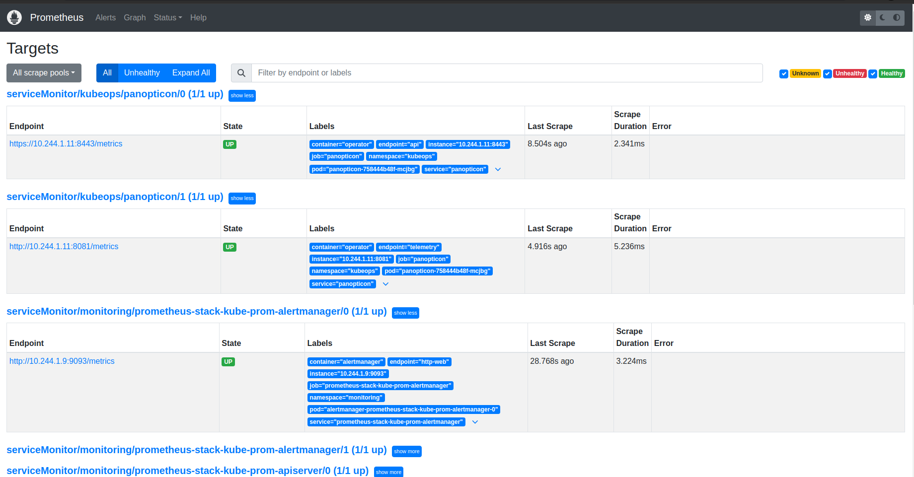

# Monitoring Using Prometheus Operator

[Prometheus Operator](https://github.com/prometheus-operator/prometheus-operator) provides a simple and Kubernetes native way to deploy and configure a Prometheus server. This tutorial will show you how to use the Prometheus operator for monitoring KubeStash.

To keep Prometheus resources isolated, we are going to use a separate namespace `monitoring` to deploy the Prometheus operator and respective resources. Create the namespace if you haven't created it yet,

```bash
$ kubectl create ns monitoring
namespace/monitoring created
```

## Install Prometheus Stack

At first, you have to install Prometheus operator in your cluster. In this section, we are going to install Prometheus operator from [prometheus-community/kube-prometheus-stack](https://github.com/prometheus-community/helm-charts/tree/main/charts/kube-prometheus-stack). You can skip this section if you already have Prometheus operator running.

Install `prometheus-community/kube-prometheus-stack` chart as below,

- Add necessary helm repositories.

```bash
helm repo add prometheus-community https://prometheus-community.github.io/helm-charts
helm repo update
```

- Install `kube-prometheus-stack` chart.

```bash
helm install prometheus-stack prometheus-community/kube-prometheus-stack -n monitoring
```

This chart will install [prometheus-operator/prometheus-operator](https://github.com/prometheus-operator/prometheus-operator), [kubernetes/kube-state-metrics](https://github.com/kubernetes/kube-state-metrics), [prometheus/node_exporter](https://github.com/prometheus/node_exporter), and [grafana/grafana](https://github.com/grafana/grafana) etc.

The above chart will also deploy a Prometheus server. Verify that the Prometheus server has been deployed by the following command:

```bash
$ kubectl get prometheus -n monitoring
NAME                                    VERSION   DESIRED   READY   RECONCILED   AVAILABLE   AGE
prometheus-stack-kube-prom-prometheus   v2.54.1   1         1       True         True        56m
```

Let's check the YAML of the above Prometheus object,

```bash
$ kubectl get prometheus -n monitoring prometheus-stack-kube-prom-prometheus -o yaml
```

```yaml
apiVersion: monitoring.coreos.com/v1
kind: Prometheus
metadata:
  annotations:
    meta.helm.sh/release-name: prometheus-stack
    meta.helm.sh/release-namespace: monitoring
  creationTimestamp: "2024-10-24T09:37:02Z"
  generation: 1
  labels:
    app: kube-prometheus-stack-prometheus
    app.kubernetes.io/instance: prometheus-stack
    app.kubernetes.io/managed-by: Helm
    app.kubernetes.io/part-of: kube-prometheus-stack
    app.kubernetes.io/version: 65.4.0
    chart: kube-prometheus-stack-65.4.0
    heritage: Helm
    release: prometheus-stack
  name: prometheus-stack-kube-prom-prometheus
  namespace: monitoring
  resourceVersion: "833936"
  uid: 72638495-f22c-4481-9d62-26bc05ade1d1
spec:
  alerting:
    alertmanagers:
    - apiVersion: v2
      name: prometheus-stack-kube-prom-alertmanager
      namespace: monitoring
      pathPrefix: /
      port: http-web
  automountServiceAccountToken: true
  enableAdminAPI: false
  evaluationInterval: 30s
  externalUrl: http://prometheus-stack-kube-prom-prometheus.monitoring:9090
  hostNetwork: false
  image: quay.io/prometheus/prometheus:v2.54.1
  listenLocal: false
  logFormat: logfmt
  logLevel: info
  paused: false
  podMonitorNamespaceSelector: {}
  podMonitorSelector:
    matchLabels:
      release: prometheus-stack
  portName: http-web
  probeNamespaceSelector: {}
  probeSelector:
    matchLabels:
      release: prometheus-stack
  replicas: 1
  retention: 10d
  routePrefix: /
  ruleNamespaceSelector: {}
  ruleSelector:
    matchLabels:
      release: prometheus-stack
  scrapeConfigSelector:
    matchLabels:
      release: prometheus-stack
  scrapeInterval: 30s
  securityContext:
    fsGroup: 2000
    runAsGroup: 2000
    runAsNonRoot: true
    runAsUser: 1000
    seccompProfile:
      type: RuntimeDefault
  serviceAccountName: prometheus-stack-kube-prom-prometheus
  serviceMonitorNamespaceSelector: {}
  serviceMonitorSelector:
    matchLabels:
      release: prometheus-stack
  shards: 1
  tsdb:
    outOfOrderTimeWindow: 0s
  version: v2.54.1
  walCompression: true
status:
  availableReplicas: 1
  conditions:
  - lastTransitionTime: "2024-10-24T09:56:28Z"
    message: ""
    observedGeneration: 1
    reason: ""
    status: "True"
    type: Available
  - lastTransitionTime: "2024-10-24T09:56:28Z"
    message: ""
    observedGeneration: 1
    reason: ""
    status: "True"
    type: Reconciled
  paused: false
  replicas: 1
  selector: app.kubernetes.io/instance=prometheus-stack-kube-prom-prometheus,app.kubernetes.io/managed-by=prometheus-operator,app.kubernetes.io/name=prometheus,operator.prometheus.io/name=prometheus-stack-kube-prom-prometheus,prometheus=prometheus-stack-kube-prom-prometheus
  shardStatuses:
  - availableReplicas: 1
    replicas: 1
    shardID: "0"
    unavailableReplicas: 0
    updatedReplicas: 1
  shards: 1
  unavailableReplicas: 0
  updatedReplicas: 1
```

Notice the following ServiceMonitor related sections,

```yaml
serviceMonitorNamespaceSelector: {} # select from all namespaces
serviceMonitorSelector:
  matchLabels:
    release: prometheus-stack
```

Here, you can see the Prometheus server is selecting the ServiceMonitors from all namespaces that have `release: prometheus-stack` label.

The above chart will also create a Service for the Prometheus server so that we can access the Prometheus Web UI. Let's verify the Service has been created,

```bash
$ kubectl get service -n monitoring
NAME                                        TYPE        CLUSTER-IP       EXTERNAL-IP   PORT(S)                      AGE
alertmanager-operated                       ClusterIP   None             <none>        9093/TCP,9094/TCP,9094/UDP   83m
prometheus-operated                         ClusterIP   None             <none>        9090/TCP                     83m
prometheus-stack-grafana                    ClusterIP   10.98.135.51     <none>        80/TCP                       86m
prometheus-stack-kube-prom-alertmanager     ClusterIP   10.96.172.18     <none>        9093/TCP,8080/TCP            86m
prometheus-stack-kube-prom-operator         ClusterIP   10.111.107.151   <none>        443/TCP                      86m
prometheus-stack-kube-prom-prometheus       ClusterIP   10.96.97.70      <none>        9090/TCP,8080/TCP            86m
prometheus-stack-kube-state-metrics         ClusterIP   10.98.39.183     <none>        8080/TCP                     86m
prometheus-stack-prometheus-node-exporter   ClusterIP   10.110.180.192   <none>        9100/TCP                     86m
```

Here, we can use the `prometheus-stack-kube-prom-prometheus` Service to access the Web UI of our Prometheus Server.

## Enable Monitoring in KubeStash

During the installation of KubeStash, all the necessary `MetricsConfigurations` are created. You can find these `MetricsConfigurations` using the following command:

```bash
$ kubectl get metricsconfigurations
NAME                                         APIVERSION                       KIND                  AGE
kubestash-appscode-com-backupconfiguration   core.kubestash.com/v1alpha1      BackupConfiguration   113m
kubestash-appscode-com-backupsession         core.kubestash.com/v1alpha1      BackupSession         113m
kubestash-appscode-com-backupstorage         storage.kubestash.com/v1alpha1   BackupStorage         113m
kubestash-appscode-com-repository            storage.kubestash.com/v1alpha1   Repository            113m
kubestash-appscode-com-restoresession        core.kubestash.com/v1alpha1      RestoreSession        113m
kubestash-appscode-com-snapshot              storage.kubestash.com/v1alpha1   Snapshot              113m
```

Next, you need to install `Panopticon`. You can install `Panopticon` using the following commands:

```bash
$ helm repo add appscode https://charts.appscode.com/stable/
$ helm repo update

$ helm install panopticon appscode/panopticon -n kubeops \
    --create-namespace \
    --set monitoring.enabled=true \
    --set monitoring.agent=prometheus.io/operator \
    --set monitoring.serviceMonitor.labels.release=prometheus-stack \
    --set-file license=/path/to/license-file.txt
```

## Verify Monitoring

As soon as the KubeStash operator pod goes into the `Running` state, the Prometheus server we have deployed in the first section should discover the endpoints exposed by KubeStash for metrics.

Now, we are going to [forward port](https://kubernetes.io/docs/tasks/access-application-cluster/port-forward-access-application-cluster/) of `prometheus-stack-kube-prom-prometheus` Service to access the Prometheus web UI. Run the following command on a separate terminal,

```bash
$ kubectl port-forward -n monitoring service/prometheus-stack-kube-prom-prometheus 9090
Forwarding from 127.0.0.1:9090 -> 9090
Forwarding from [::1]:9090 -> 9090
```

Now, you can access the Web UI at `localhost:9090`. Open [http://localhost:9090/targets](http://localhost:9090/targets) in your browser. You should see `Panopticon` service monitors. This verifies that the Prometheus server is scrapping KubeStash metrics using `Panopticon`.

<figure align="center">
  
<figcaption align="center">Fig: Prometheus Web UI</figcaption>
</figure>

## Cleanup

To cleanup the Kubernetes resources created by this tutorial, run:

```bash
# cleanup Prometheus resources
helm delete prometheus-stack -n monitoring

# delete namespace
kubectl delete ns monitoring
```

To uninstall KubeStash follow this [guide](/docs/setup/README.md).
