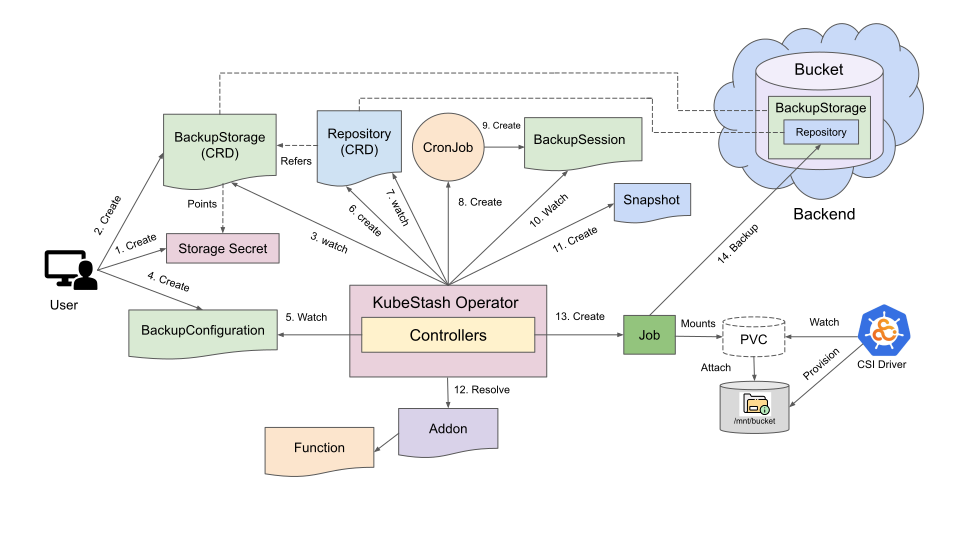

# Backup and Restore Cloud Object Storage using KubeStash

Cloud object storage backup is a critical requirement for any cloud-native application. In many cases, you may have data stored in an externally hosted S3-compatible service and want to archive it to cold or long-term storage. **KubeStash** provides a simple, secure, and Kubernetes-native way to back up and restore data from cloud object storage.

This guide explains how KubeStash can be used to back up and restore cloud object storage services such as **AWS S3 or S3-compatible buckets, Google Cloud Storage, and Azure Blob Storage**, enabling reliable protection and recovery of your object data across different cloud providers.

## Before You Begin

- You should be familiar with the following `KubeStash` concepts:
    - [BackupConfiguration](/docs/concepts/crds/backupconfiguration/index.md)
    - [BackupSession](/docs/concepts/crds/backupsession/index.md)
    - [RestoreSession](/docs/concepts/crds/restoresession/index.md)
    - [BackupStorage](/docs/concepts/crds/backupstorage/index.md)

## How Backup Process Works

The following diagram shows how KubeStash takes backup of cloud object storage. Open the image in a new tab to see the enlarged version.

<figure align="center">
   
    <figcaption align="center">Fig: Backup process of Cloud Object Storage in KubeStash</figcaption>
</figure>

The backup process consists of the following steps:

1. At first, a user creates a `Secret`. This secret holds the credentials to access the backend where the backed up data will be stored.

2. Then, she creates a `BackupStorage` custom resource that specifies the backend information, along with the `Secret` containing the credentials needed to access the backend.

3. KubeStash operator watches for `BackupStorage` custom resources. When it finds a `BackupStorage` object, it initializes the `BackupStorage` by uploading the `metadata.yaml` file into the target storage.

4. The user must install the provider–supported CSI driver based on their object storage, for example:

   * **AWS S3 Bucket** → [Mountpoint for Amazon S3 CSI Driver](https://github.com/awslabs/mountpoint-s3-csi-driver) (allows Kubernetes apps to access S3 buckets as file system volumes)
   * **S3-compatible storage** → [k8s-csi-s3 (S3 CSI driver)](https://github.com/yandex-cloud/k8s-csi-s3) (CSI driver for S3 or S3 compatible storage)
   * **Google Cloud Storage** → [gcs-fuse-csi-driver (Google Cloud Storage FUSE CSI)](https://github.com/GoogleCloudPlatform/gcs-fuse-csi-driver) (mounts GCS buckets as volumes)
   * **Azure Blob Storage** → [Azure Blob Storage CSI Driver (blob-csi-driver)](https://github.com/kubernetes-sigs/blob-csi-driver) (CSI driver for Azure Blob Storage)

5. After installing the CSI driver, the user should create a **PersistentVolumeClaim (PVC)** that references this CSI driver (via a `StorageClass` or directly in the PVC spec). The CSI driver will then provision a volume and bind it to the PVC. Once bound, the **KubeStash backup or restore pod** can mount this PVC to access the object storage bucket from within a pod.

6. Then, she creates a `BackupConfiguration` custom resource that specifies the targeted **PersistentVolumeClaim (PVC)**, the Addon info with a specified task, etc. It also provides information about one or more repositories, each indicating a path and a `BackupStorage` for storing the backed-up data.

7. KubeStash operator watches for `BackupConfiguration` objects.

8. Once the KubeStash operator finds a `BackupConfiguration` object, it creates `Repository` with the information specified in the `BackupConfiguration`.

9. KubeStash operator watches for `Repository` custom resources. When it finds the `Repository` object, it Initializes `Repository` by uploading `repository.yaml` file into the `spec.sessions[*].repositories[*].directory` path specified in `BackupConfiguration`.

10. Then, it creates a `CronJob` for each session with the schedule specified in `BackupConfiguration` to trigger backup periodically.

11. On the next scheduled slot, the `CronJob` triggers a backup by creating a `BackupSession` custom resource.

12. KubeStash operator watches for `BackupSession` custom resources.

13. When it finds a `BackupSession` object, it creates a `Snapshot` custom resource for each `Repository` specified in the `BackupConfiguration`.

14. Then it resolves the respective `Addon` and `Function` and prepares backup `Job`(s) definition.

15. Then, it mounts the targeted workload volume(s) into the `Job`(s) and creates it/them.

16. The `Job`(s) takes backup of the targeted workload.

17. After the backup process is completed, the backup `Job`(s) updates the `status.components[*]` field of the `Snapshot` resources with backup information of the target application components.

## How Restore Process Works

Restore process is pretty much straight forward; you can restore to any PVC (Provisioned by any CSI Driver). The following diagram shows how KubeStash restores backed up data inside a workload. Open the image in a new tab to see the enlarged version.

<figure align="center">
   
    <figcaption align="center">Fig: Restore process of Workload volumes in KubeStash</figcaption>
</figure>

The restore process consists of the following steps:

1. At first, the user creates a workload where the data will be restored or the user can use the same workload.

2. Then, she creates a `RestoreSession` custom resource that specifies the target workload volume(s) where the backed-up data will be restored, the `Repository` object that points to a `BackupStorage` that holds backend information, and the target `Snapshot`, which will be restored. It also specifies the `Addon` info with task to use to restore the volume.

3. KubeStash operator watches for `RestoreSession` custom resources.

4. When it finds a `RestoreSession` custom resource, it resolves the respective `Addon` and `Function` and prepares a restore `Job`(s) definition.

5. The restore `Job`(s) restores the backed-up data into the targeted workload volume(s).

6. Finally, when the restore process is completed, the `Job`(s) updates the `status.components[*]` field of the `RestoreSession` with restore information of the target application components.

## Next Steps

1. See a step by step guide to backup/restore of a S3 compatible bucket to the original AWS S3 [here](/docs/guides/workloads/deployment/index.md).

[//]: # (2. See a step by step guide to backup/restore volumes of a StatefulSet [here]&#40;/docs/guides/workloads/statefulset/index.md&#41;.)

[//]: # (3. See a step by step guide to backup/restore a DaemonSet's volumes [here]&#40;/docs/guides/workloads/daemonset/index.md&#41;.)
