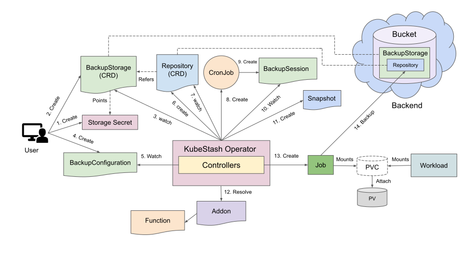
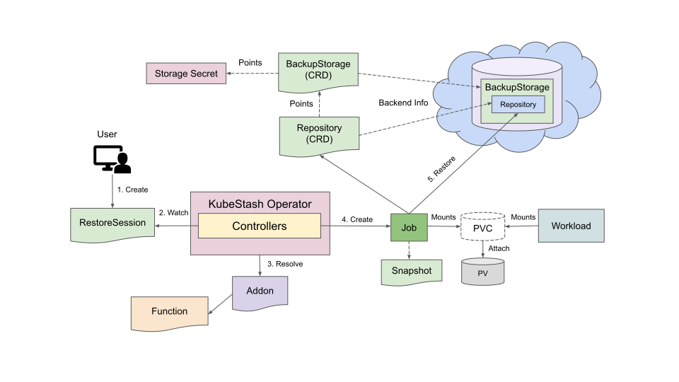

# Stand-alone Volume Backup Overview

This guide will give you an overview of how stand-alone volume backup and restore process works in KubeStash.

## How Backup Works

The following diagram shows how KubeStash takes backup of a stand-alone volume. Open the image in a new tab to see the enlarged version.

<figure align="center">
  
  <figcaption align="center">Fig: Stand-alone Volume Backup Overview</figcaption>
</figure>

The backup process consists of the following steps:

1. At first, a user creates a `Secret`. This secret holds the credentials to access the backend where the backed up data will be stored.

2. Then, she creates a `BackupStorage` custom resource that specifies the backend information, along with the `Secret` containing the credentials needed to access the backend.

3. KubeStash operator watches for `BackupStorage` custom resources. When it finds a `BackupStorage` object, it initializes the `BackupStorage` by uploading the `metadata.yaml` file into the target storage.

4. Then, she creates a `BackupConfiguration` custom resource which specifies the targeted standalone volume and also creates  an encryption `Secret` resource which will be used to encode/decode the backed up data. The `BackupConfiguration` object specifies the `Repository` pointing to a `BackupStorage` that contains backend information, indicating where to upload backup data. It also defines the `Addon` information with a specified tasks and their configuration parameters to be used for backing up the volume.

5. KubeStash operator watches for `BackupConfiguration` custom resources.

6. Once the KubeStash operator finds a `BackupConfiguration` object, it creates `Repository` with the information specified in the BackupConfiguration.

7. KubeStash operator watches for `Repository` custom resources. When it finds the `Repository` object, it Initializes `Repository` by uploading `repository.yaml` file into the `spec.sessions[*].repositories[*].directory` path specified in `BackupConfiguration`.
 
8. Then, it creates a `CronJob` for each session with the schedule specified in `BackupConfiguration` to trigger backup periodically.
 
9. On the next scheduled slot, the `CronJob` triggers a backup by creating a `BackupSession` custom resource.

10. KubeStash operator watches for `BackupSession` custom resources.
 
11. When it finds a `BackupSession` object, it creates a `Snapshot` custom resource for each `Repository` specified in the `BackupConfiguration`.
 
12. Then, it resolves the respective `Addon` and `Function` and prepares a backup `Job` definition.
 
13. Then, it mounts the targeted stand-alone volume into the `Job` and creates it.
 
14. The `Job` takes backup of the targeted stand-alone volume.

15. After the backup process is completed, the backup `Job` updates the `status.components[*]` field of the `Snapshot` object with target volume information. It also updates the `status.phase` field of the `BackupSession` to reflect backup completion.

## How Restore Works

The following diagram shows how KubeStash restores backed up data into a stand-alone volume. Open the image in a new tab to see the enlarged version.

<figure align="center">
  
  <figcaption align="center">Fig: Stand-alone Volume Restore Overview</figcaption>
</figure>

The restore process consists of the following steps:

1. At first, the user creates a stand-alone volume where the data will be restored or the user can use the same stand-alone volume.

2. Then, she creates a `RestoreSession` custom resource, specifying the target stand-alone volume where the backed-up data will be restored, the `Repository` object that points to a `BackupStorage` that holds backend information, and the target `Snapshot`, which will be restored. It also specifies the `Addon` info with task to use to restore the volume.

3. KubeStash operator watches for `RestoreSession` custom resources.

4. Once it finds a `RestoreSession` object, it resolves the respective `Addon` and `Function` and prepares a restore Job definition.

5. Then, it mounts the targeted volume and creates a Restore `Job`.

6. The restore `Job` restores the backed-up data into the targeted volume.

7. Finally, when the restore process is completed, the job updates the `status.phase` field of the `Restoresession` to reflect restore completion.

## Next Steps

- Learn how to take backup and restore a stand-alone PVC from [here](/docs/guides/volumes/pvc/index.md).
