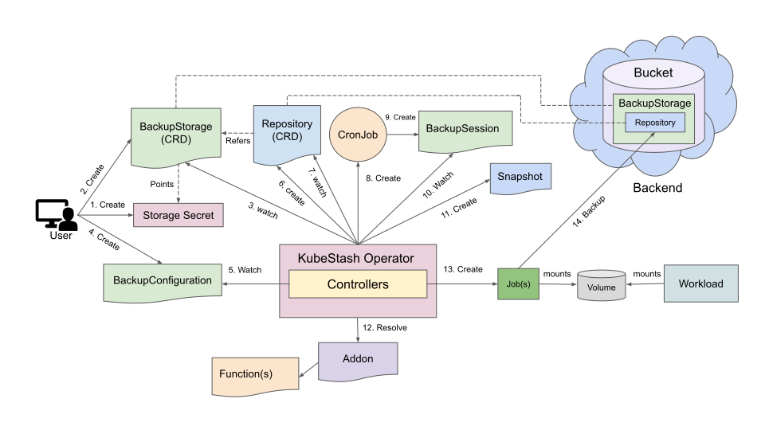
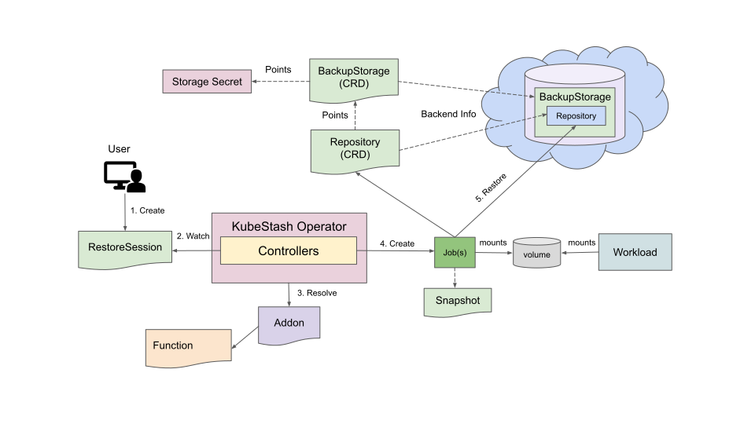

# Backup and Restore Workloads using KubeStash

This guide will show you how KubeStash backs up and restores volumes of various workload types (Deployment, StatefulSet, DaemonSet etc.).

## Before You Begin

- You should be familiar with the following `KubeStash` concepts:
  - [BackupConfiguration](/docs/concepts/crds/backupconfiguration/index.md)
  - [BackupSession](/docs/concepts/crds/backupsession/index.md)
  - [RestoreSession](/docs/concepts/crds/restoresession/index.md)
  - [BackupStorage](/docs/concepts/crds/backupstorage/index.md)

## How Backup Process Works

The following diagram shows how KubeStash takes backup of the volumes of a workload. Open the image in a new tab to see the enlarged version.

<figure align="center">
   
    <figcaption align="center">Fig: Backup process of Workload volumes in KubeStash</figcaption>
</figure>

The backup process consists of the following steps:

1. At first, a user creates a `Secret`. This secret holds the credentials to access the backend where the backed up data will be stored.

2. Then, she creates a `BackupStorage` custom resource that specifies the backend information, along with the `Secret` containing the credentials needed to access the backend.

3. KubeStash operator watches for `BackupStorage` custom resources. When it finds a `BackupStorage` object, it initializes the `BackupStorage` by uploading the `metadata.yaml` file into the target storage.

4. Then, she creates a `BackupConfiguration` custom resource that specifies the targeted workload, the Addon info with a specified task, etc. It also provides information about one or more repositories, each indicating a path and a `BackupStorage` for storing the backed-up data.

5. KubeStash operator watches for `BackupConfiguration` objects.

6. Once the KubeStash operator finds a `BackupConfiguration` object, it creates `Repository` with the information specified in the `BackupConfiguration`.

7. KubeStash operator watches for `Repository` custom resources. When it finds the `Repository` object, it Initializes `Repository` by uploading `repository.yaml` file into the `spec.sessions[*].repositories[*].directory` path specified in `BackupConfiguration`.

8. Then, it creates a `CronJob` for each session with the schedule specified in `BackupConfiguration` to trigger backup periodically.

9. On the next scheduled slot, the `CronJob` triggers a backup by creating a `BackupSession` custom resource.

10. KubeStash operator watches for `BackupSession` custom resources.

11. When it finds a `BackupSession` object, it creates a `Snapshot` custom resource for each `Repository` specified in the `BackupConfiguration`.

12. Then it resolves the respective `Addon` and `Function` and prepares backup `Job`(s) definition.

13. Then, it mounts the targeted workload volume(s) into the `Job`(s) and creates it/them.

14. The `Job`(s) takes backup of the targeted workload.

15. After the backup process is completed, the backup `Job`(s) updates the `status.components[*]` field of the `Snapshot` resources with backup information of the target application components.

## How Restore Process Works

The following diagram shows how KubeStash restores backed up data inside a workload. Open the image in a new tab to see the enlarged version.

<figure align="center">
   
    <figcaption align="center">Fig: Restore process of Workload volumes in KubeStash</figcaption>
</figure>

The restore process consists of the following steps:

1. At first, the user creates a workload where the data will be restored or the user can use the same workload.

2. Then, she creates a `RestoreSession` custom resource that specifies the target workload volume(s) where the backed-up data will be restored, the `Repository` object that points to a `BackupStorage` that holds backend information, and the target `Snapshot`, which will be restored. It also specifies the `Addon` info with task to use to restore the volume.

3. KubeStash operator watches for `RestoreSession` custom resources.

4. When it finds a `RestoreSession` custom resource, it resolves the respective `Addon` and `Function` and prepares a restore `Job`(s) definition.

5. The restore `Job`(s) restores the backed-up data into the targeted workload volume(s).

6. Finally, when the restore process is completed, the `Job`(s) updates the `status.components[*]` field of the `RestoreSession` with restore information of the target application components.

## Next Steps

1. See a step by step guide to backup/restore volumes of a Deployment [here](/docs/guides/workloads/deployment/index.md).
2. See a step by step guide to backup/restore volumes of a StatefulSet [here](/docs/guides/workloads/statefulset/index.md).
3. See a step by step guide to backup/restore a DaemonSet's volumes [here](/docs/guides/workloads/daemonset/index.md).
